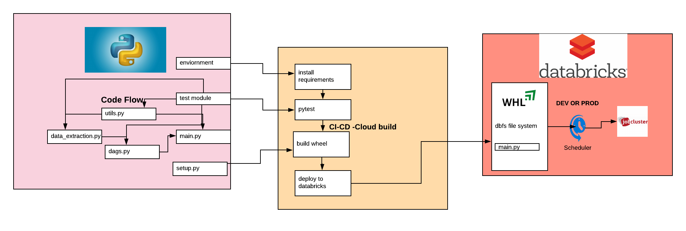

Introduction
================

The project tries to mimic real life data engineering process. In this process it uses github api to extract the data
and write it back to google cloud big query.

The process is divided by below.

1. Main
    Entry point for the execution
2. Utils
    Common and reusable functions for orchestration of the project
3. Dags
    To divide the workflow via parameters
4. Config
    Configuration files for access etc
5. Document
    For sphinx documentation
6. Consolidated
    Data extraction script, based on the type of process e.g. raw, consolidated or feature

Method
--------

Python has been chosen language to do this process. Code is compliant with PEP 8 guidelines. There are multiple options
possible for the execution of the project, e.g. dataflow, cloud scheduler (with serverless function). However we have
chosen databricks as it could be all in one platform to operate the data engineering, machine learning, analytics and much more.
Also using databricks-spark gives much more parallel computing power to process large volume of data compared with traditional python.
keeping all this activities in mind we have chosen databricks route.

CI-CD
------

Ideally we would build a CI-CD pipeline to deploy wheel file to databricks dbfs location. The CI-CD pipeline would do
below activity using google cloud build.

1. Install requirements from requirements.txt (located in environment folder)
2. Run pytest - with the aim to have 90% code coverage
3. Build Wheel
4. Deploy Wheel to databricks environment for easy accessibility

Note: This task is still WIP

End to End Flow
===================

